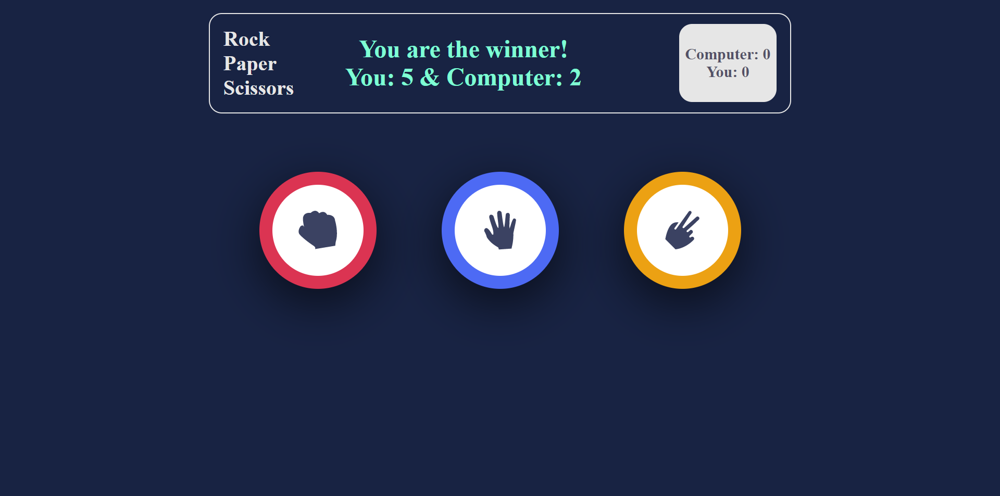

# rock-paper-scissors
The Odin Project - Rock Paper Scissor Solution

Solution for the [PROJECT: Rock Paper Scissors](https://www.theodinproject.com/paths/foundations/courses/foundations/lessons/rock-paper-scissors) from the [Javascript Basics](https://www.theodinproject.com/paths/foundations/courses/foundations#javascript-basics) part of [The Odin Project](https://www.theodinproject.com/).

## My process
Hello, this is my 2nd project here in The Odin Project. It's a simple Rock Paper Scissors game.
the design idea is taken from the Frontend Mentors Rock-Paper-Scissors exercise design. Although the design is not exactly the same as Frontend Mentors' design. I will make this project's design the same as the frontend mentors' design later.

## Table of contents
- [Overview](#overview)
  - [Requirement](#project-requirement)
  - [Solution Screenshot](#solution-screenshot)
  - [Links](#links)
- [My process](#my-process)
  - [Built with](#built-with)
  - [What I learned](#what-i-learned)
- [Author](#author)
- [Image Credit](#image-credit)

### Project-Requirement
Have to implement functionality for a basic Rock Paper Scissors game that can be played from browser. GUI should have some style.

### Solution Screenshot
The final output:

Currently it's only for Desktop. I'll make responsive later

### Links
Live Site URL: [Live site of the challenge hosted here](https://mainul-islam-nirob.github.io/rock-paper-scissors/)

### Built with
- Basic JavaScript
    - variable
    - array
    - random number
    - conditional statement
    - function
    - DOM
- HTML5
- CSS
    - flexbox
    - css variable
    - etc

### What I learned
- How to solve a problem step by step
- 3 stages in problem solving process
    - Understand the problem
    - Plan
    - Implement
- Importance of writing pseudocode for solving problem

## Author
- Website - Well I haven't made my profile portfolio, gonna make it sooon when I know a lot of stuffs
- LinkedIn - [@mainul islam](https://www.linkedin.com/in/mainul-islam-nirob/)
- Twitter - [@mainul](https://twitter.com/Mainuli96601040)
- FreeCodeCamp - [@mainul](https://www.freecodecamp.org/mainul)

## Image Credit
The images of rock, paper, and scissors are taken from Frontend Mentors Rock-Paper-Scissors exercise resources. 